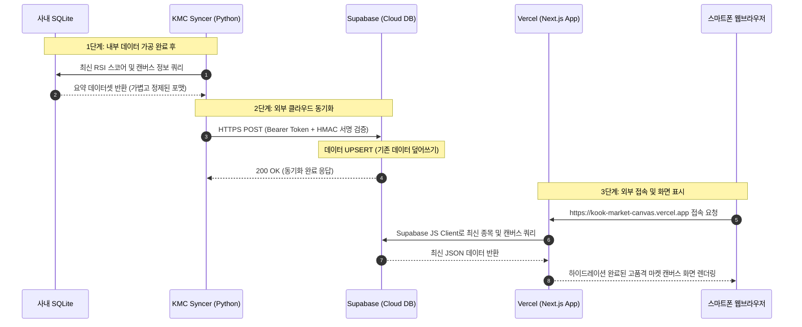

# KMC: KOOK Market Canvas 시스템 아키텍처 및 데이터 흐름도

* **기준일**: 2026-06-03
* **문서 목적**: 사내 망 내부의 데이터 수집 엔진과 외부 퍼블릭 클라우드 간의 유기적인 연동 구조 및 데이터 흐름을 명시하여, 유지보수 및 추후 인프라 확장의 기준점으로 삼는다.

---

## 1. 아키텍처 개요 (Architecture Overview)

본 시스템은 **"데이터의 수집/연산은 사내 서버 내부에서 무겁게 처리하고, 정제된 조회용 결과(Read Model)만 외부 클라우드로 단방향 업로드한다"**는 **하이브리드 아키텍처**를 채택하고 있습니다.

이 설계를 통해 다음 세 가지 핵심 이점을 달성합니다:
1. **0원의 비용(Free Tier)**: Vercel과 Supabase의 무료 플랜 한도 내에서 완벽하게 무한 구동됩니다.
2. **최강의 보안(No Inbound)**: 외부망에서 사내 서버로 들어오는 접속 포트(Inbound)를 완전히 차단합니다. 사내 서버가 외부 DB로 밀어 올리는 아웃바운드(Outbound) 통신만 허용하므로, 해킹 위협과 Tailscale VPN 켜는 번거로움이 동시에 해결됩니다.
3. **가볍고 빠른 UI**: Next.js App Router와 외부 Supabase PostgreSQL 간의 연동으로 전 세계 어디서든 스마트폰으로 버벅임 없이 1초 내에 화면이 로드됩니다.

---

## 2. 시스템 아키텍처 맵 (System Architecture Map)

```mermaid
graph TD
    %% 스타일 정의
    classDef company fill:#1e293b,stroke:#3b82f6,stroke-width:2px,color:#f8fafc;
    classDef cloud fill:#0f172a,stroke:#10b981,stroke-width:2px,color:#f8fafc;
    classDef user fill:#312e81,stroke:#6366f1,stroke-width:2px,color:#f8fafc;

    subgraph Company_Network ["사내 내부망 (Company Network - Local System)"]
        Hermes["Hermes Engine (데이터 수집 & RSI/과열도 연산)"]
        SQLite[("로컬 SQLite DB / CSV / JSON")]
        Syncer["KMC Syncer (Python 업로더)"]
        
        Hermes -->|데이터 가공 및 적재| SQLite
        SQLite -->|주기적 추출 (Cron)| Syncer
    end

    subgraph Cloud_Infrastructure ["클라우드 인프라 (Cloud Infrastructure - SaaS)"]
        Supabase[("Supabase DB (무료 PostgreSQL)")]
        Vercel["Vercel (무료 Next.js App Shell / Static Web)"]
    end

    subgraph External_Network ["외부 사외망 (Public Internet)"]
        User["KMC 사용자 (스마트폰, 사외 PC)"]
    end

    %% 데이터 흐름 및 보안 장벽
    Syncer -->|1. Outbound HTTPS / HMAC 검증| Supabase
    Vercel -->|2. 읽기 전용 쿼리 (Supabase API)| Supabase
    User -->|3. 웹 접속 (Tailscale VPN 없음)| Vercel
    Vercel -->|4. 반응형 UI 렌더링| User

    %% 클래스 지정
    class Hermes,SQLite,Syncer company;
    class Supabase,Vercel cloud;
    class User user;
```

---

## 3. 구성 요소별 역할 및 명세

### 1) 사내 내부망 (Company Network)
* **Hermes Engine**: 야간 및 주기적으로 백그라운드에서 동작하며, 국내외 마켓 데이터 수집, 가공, RSI 등 핵심 투자 평가지표 산출을 전담합니다.
* **SQLite 데이터베이스**: 수집된 원천 로우(Raw) 데이터와 고비용 연산 결과물이 저장되는 마스터 저장소입니다.
* **KMC Syncer ([kmc_syncer.py](file:///mnt/c/Active/APP_STOCK/services/materializer/kmc_syncer.py))**: 
  * 로컬 SQLite에서 캔버스 뷰에 필요한 **최종 요약 레코드(Read Model)**만 SQL 쿼리로 추출합니다.
  * 외부 Supabase REST API 포맷으로 변환 후, API 보안 키 및 HMAC 비밀키를 헤더에 실어 안전하게 아웃바운드로 발송합니다.

### 2) 클라우드 인프라 (Cloud SaaS)
* **Supabase (PostgreSQL)**: 
  * 외부 노출용 초경량 데이터베이스 서버입니다.
  * 테이블 정의서([erd.md](file:///mnt/c/Active/APP_STOCK/docs/erd.md))에 정의된 스키마에 따라 사내 서버로부터 전송된 최신 종목 상태와 투자 캔버스 구조를 유지합니다.
* **Vercel (Next.js Application)**: 
  * [https://kook-market-canvas.vercel.app](https://kook-market-canvas.vercel.app) 주소로 매핑된 정적/서버리스 웹 호스팅 환경입니다.
  * 빌드 및 배포가 GitHub main 브랜치 푸시와 유기적으로 연동되어 있습니다.

### 3) 외부 클라이언트 (Public Client)
* **KMC 사용자 웹 브라우저**: Tailscale VPN을 켜거나 복잡한 인증 절차를 거치지 않고, 퍼블릭 Vercel 배포 주소로 직접 진입하여 최신 투자 리서치 데이터를 브라우징합니다.

---

## 4. 데이터 동기화 시퀀스 (Data Synchronization Sequence)

사내 서버에서 분석된 최신 데이터가 외부 스마트폰 화면에 노출되기까지의 단계별 동기화 흐름입니다:



---

## 5. 보안 및 안전장치 (Security Guidelines)

1. **단방향 통신 원칙 (Outbound Only)**:
   * 사내망 방화벽 설정에서 외부로부터 들어오는 모든 Inbound 연결(포트 포워딩 등)은 **영구 차단(Deny All)** 상태를 유지합니다.
2. **Supabase API Key 관리**:
   * Supabase DB 접속용 비밀키는 로컬 Syncer 및 Vercel의 환경 변수(Environment Variables) 영역에만 등록하며, **GitHub 소스코드 리포지토리에는 절대 하드코딩하여 커밋하지 않습니다**.
3. **데이터 유출 차단**:
   * 로우(Raw) 데이터나 사내 내부에서 사용하는 원천 정보는 로컬 SQLite에 가둡니다. 오직 가공이 완료된 **"최종 리서치 등급 및 종목 코드 요약 정보"**만 Supabase로 업로드되도록 동기화 데이터 대상을 엄격히 통제합니다.
