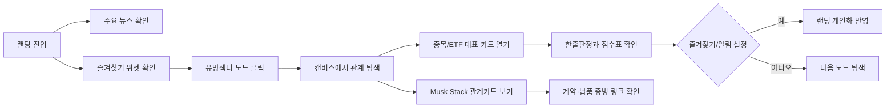
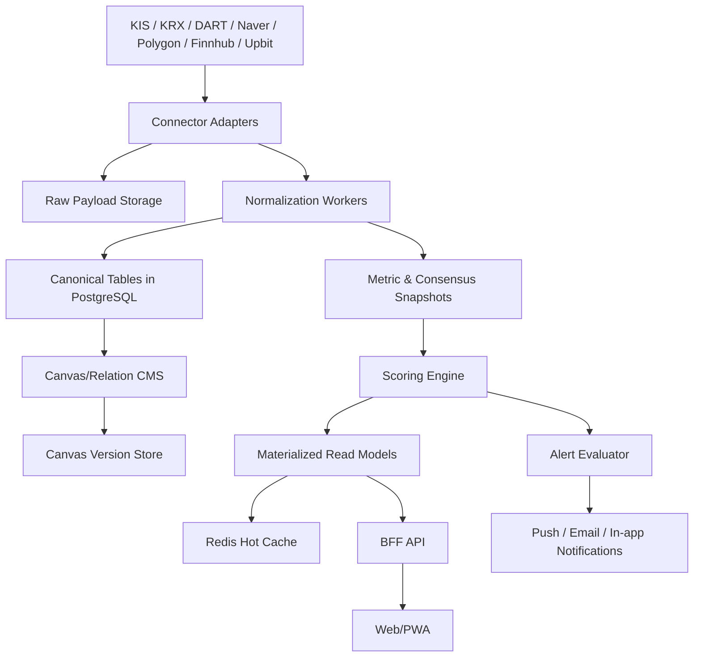
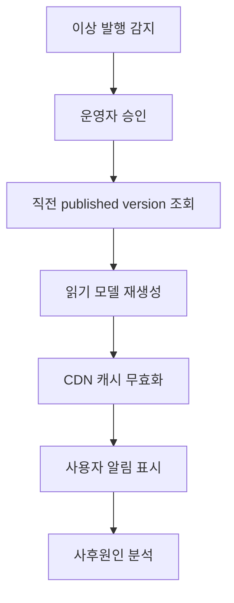
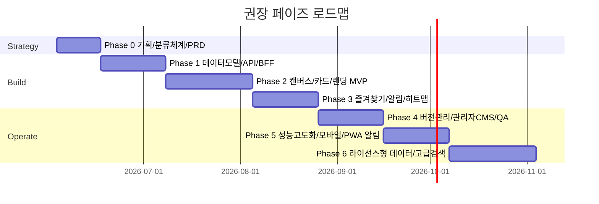

# 유망섹터 밸류체인 맵과 Musk Stack 탭을 포함한 시스템 개발 보고서

## Executive Summary

이 프로젝트의 가장 강한 제품 정의는 **“편집 가능한 산업 캔버스 + 실시간 시장 데이터 + 종목/ETF 판단 카드 + 개인화 랜딩”**의 결합이다. 단순한 테마 목록이나 뉴스 모음이 아니라, 유망섹터와 세부 밸류체인을 **그래프형 지식 레이어**로 관리하고, 그 위에 **시세·수급·공시·애널리스트 의견·과열도/적합도 점수**를 덧씌워 “지금 들어갈지 말지”를 판단하도록 만드는 구조가 핵심이다. 국내 주식 영역에서는 한국투자증권 Open API가 현재가, ETF/ETN 현재가, 투자자 동향, 종목추정실적, 종목투자의견, 증권사별 투자의견, 실시간 KRX 시세까지 폭넓게 제공하므로 1차 소스로 두기 좋고, 공시 및 재무는 OpenDART가 원문/XBRL/재무정보를 제공하므로 펀더멘털 신뢰도 축으로 적합하다. 국내 뉴스 메타데이터는 네이버 뉴스 검색 API, 미국 가격/집계는 Polygon, 미국 컨센서스는 Finnhub, 기술지표 보조는 Alpha Vantage, 암호화폐는 Upbit를 우선 계층으로 두는 것이 가장 실무적이다. Reuters/Bloomberg는 공식 라이선스 계약이 있을 때만 본문/데이터 직접 내재화 대상으로 두는 편이 안전하다. citeturn36view0turn9search4turn28view0turn4search9turn31search0turn34view0turn35view0turn6search2turn6search3

MVP는 넓게 시작하면 안 된다. 첫 출시에서는 **랜딩페이지, 유망섹터 밸류체인 탭, Musk Stack 탭, 종목/ETF 카드, 즐겨찾기, 뉴스/공시 피드, 캔버스 버전관리, 기본 알림**까지만 강하게 만드는 편이 맞다. 히트맵은 반드시 포함하되, 초기에는 **국내/미국/암호화폐 3개 유니버스의 일간·분간 냉/온도 시각화** 수준으로 두고, 초고빈도 실시간 회전 분석은 2차 확장으로 미루는 것이 개발 리스크와 운영비를 줄인다. 특히 KOOK님 요구처럼 랜딩은 “주요 뉴스 + 내가 별표한 노드/종목/ETF/관계카드”가 중심이 되어야 하고, 유망섹터 내부 별표는 바로 랜딩 개인화 피드로 역류하도록 설계해야 한다. citeturn28view0turn36view0turn35view1

기술적으로는 **PWA 우선 전략**이 가장 적합하다. PWA는 단일 코드베이스로 설치형 경험, 오프라인 캐시, 백그라운드 자산 갱신, 푸시 알림을 제공할 수 있고, 서비스 워커는 네트워크와 앱 사이의 프록시처럼 동작하여 캐시·오프라인·푸시 처리에 유리하다. Apple은 iOS 16.4 이후 홈 화면 웹앱의 Web Push를 지원하고, Safari/macOS도 Web Push를 지원하므로 초기 모바일 전략으로 충분하다. 다만 홈 위젯, 더 강한 백그라운드 작업, 네이티브 수준의 생체인증/실시간 위젯이 필요해지면 2단계에서 네이티브 래핑 또는 별도 앱을 검토하면 된다. citeturn10search0turn10search2turn10search5turn11search1turn11search3

백엔드는 **API Gateway/BFF + 시장데이터 수집 + 스코어링 + 캔버스/그래프 + 즐겨찾기/알림 + 검색 + 관리자 CMS**로 나누는 것이 적절하다. 저장소는 **PostgreSQL 중심**으로 시작하고, 검색은 PostgreSQL Full Text Search와 `pg_trgm`으로 MVP를 충분히 커버할 수 있다. Redis는 캐시, 레이트리밋, 큐 버퍼에 사용하고, 원시 페이로드 및 캔버스 스냅샷은 객체 스토리지에 저장한다. 읽기가 쓰기보다 압도적으로 많은 카드/랜딩/섹터 페이지 특성상 선택적 CQRS가 유효하지만, 플랫폼 전체 이벤트 소싱은 복잡도가 높으므로 **캔버스 버전관리와 감사로그 정도에만 제한적으로 적용**하는 것이 낫다. citeturn16search3turn16search0turn27view0turn25search7

보안과 운영 관점에서 가장 중요한 것은 **비밀키 비노출, 공급사 레이트리밋 흡수, 로그/감사 추적, 라이선스 준수, 데이터 신뢰도 표시**다. 네이버 뉴스 API는 비로그인 방식이지만 클라이언트 ID/시크릿이 필요하고, Upbit는 브라우저 Origin 헤더 요청 시 시세 API가 10초당 1회 제한을 받으므로 프론트 직호출보다 BFF 프록시가 적합하다. OpenDART는 20,000건 이상 요청 시 제한 오류가 날 수 있고, Reuters 콘텐츠는 별도 agreement 없이는 editorial use only 제약이 존재하며, Bloomberg는 Data License를 전제로 기업용 워크플로 통합을 제공한다. 따라서 **외부 제공자의 본문/원문을 무단 적재하는 구조는 피하고**, API·메타데이터·링크 중심 + 별도 라이선스 체결 시 확대 방식이 바람직하다. citeturn28view0turn35view1turn9search3turn6search2turn6search3

운영비는 인프라보다 **데이터 계약 비용이 더 크게 튀는 구조**가 된다. 관리형 클라우드 기반 MVP 인프라는 비교적 억제 가능하지만, 유료 미디어/컨센서스/실시간 미국 데이터 계약을 붙이는 순간 외부 데이터 비용이 총소유비용의 상당 부분을 차지할 가능성이 높다. 그래서 1차 로드맵은 **공식 공개 API 중심 + 편집 캔버스 중심 + 개인화 UX 완성**에 두고, 2차부터 라이선스형 프리미엄 데이터 확장을 붙이는 것이 투자 대비 효율이 높다. citeturn6search3turn6search4turn31search2turn33view3

### 권장 결론 요약

| 항목 | 권장안 |
|---|---|
| 출시 전략 | 유망섹터 밸류체인 탭 + Musk Stack 탭 + 개인화 랜딩 MVP 선출시 |
| 핵심 데이터 소스 | KIS, DART, Naver News API, Polygon, Finnhub, Alpha Vantage, Upbit |
| 프론트엔드 | Next.js App Router 기반 PWA |
| 백엔드 | BFF + 수집 워커 + 스코어링 서비스 + 캔버스/CMS + 알림 서비스 |
| DB/캐시 | PostgreSQL + Redis + Object Storage |
| 검색 | PostgreSQL FTS + pg_trgm, 후속으로 고급 검색 확장 |
| 버전관리 | 캔버스 한정 이벤트 로그 + diff/rollback |
| 보안 | BFF 프록시, KMS/시크릿 로테이션, RBAC, 감사로그 |
| 모바일 | PWA 우선, 필요 시 네이티브 보강 |
| 우선순위 | 제품 정확도와 캔버스 품질 > 실시간성 과잉 경쟁 |

## 요구사항과 MVP

### 요구사항 요약

사용자 요구를 제품 관점으로 압축하면 다음 여섯 가지다. 첫째, 랜딩페이지는 뉴스 포털이 아니라 **개인별 투자 작업대**여야 한다. 둘째, 유망섹터 탭은 단순 목록이 아니라 **세부 밸류체인 관계를 시각적으로 탐색**할 수 있어야 한다. 셋째, Musk Stack은 일반 테마주 묶음이 아니라 **직접 계약·납품·통합 관계가 검증된 관계 탭**이어야 한다. 넷째, 종목을 클릭하면 “차트”보다 먼저 **과열/저평가/투자 적합성/기대값**이 한 줄과 점수표로 보여야 한다. 다섯째, 별표/즐겨찾기는 종목뿐 아니라 노드·캔버스·관계카드에도 적용되어 랜딩으로 올라와야 한다. 여섯째, 캔버스는 살아 있는 산출물이어야 하므로 **버전관리와 변경이력**이 필요하다. 이 요구는 국내 시장 데이터와 투자의견을 상당 부분 단일 공급원에서 가져올 수 있는 KIS Open API, 공시·재무를 보강하는 DART, 뉴스 메타데이터를 주는 네이버 API, 미국 가격/컨센서스를 제공하는 Polygon/Finnhub, 암호화폐 시세의 Upbit를 결합하면 구현 가능하다. citeturn36view0turn9search4turn28view0turn4search9turn31search0turn35view0

### 기능 우선순위와 MVP 정의

아래 우선순위는 “초기 사용자 수 수만 명 수준”, “기술·예산 제약 없음”, “법적 세부 검토 필요”라는 가정 아래 추천한 것이다.

| 우선순위 | 기능 | 포함 범위 | 비고 |
|---|---|---|---|
| P0 | 랜딩페이지 | 주요뉴스, 내 즐겨찾기, 오늘의 시그널, 최근 본 카드 | 핵심 진입 화면 |
| P0 | 유망섹터 밸류체인 탭 | 섹터별 노드/엣지/설명/종목/ETF/ETN/레버리지 연결 | 본체 |
| P0 | Musk Stack 탭 | 계약/납품/직접관계 검증 카드 + 증빙 링크 | 차별화 포인트 |
| P0 | 종목/ETF 대표 카드 | 점수표, 한줄판정, 목표주가/투자의견, 수급/기술/공시 | 매수판단 중심 |
| P0 | 즐겨찾기 | 종목, ETF, 노드, 캔버스, 관계카드 즐겨찾기 | 랜딩 개인화 연결 |
| P0 | 캔버스 버전관리 | 초안/발행/롤백/비교(diff) | 편집 생산성 핵심 |
| P1 | 뉴스 피드 | 국내/미국/매크로/섹터/공시/실적 피드 | 메타데이터 중심 |
| P1 | 히트맵 | 국내/미국/암호화폐, 섹터 필터, 등락/거래대금 | 초기엔 준실시간 |
| P1 | 알림 | 점수 변화, 목표가 괴리, 공시, 뉴스, 캔버스 업데이트 | 규칙형 우선 |
| P1 | 토론 링크/임베딩 | 외부 토론·리서치·IR 링크 카드 | iframe 가능 시 제한적 |
| P2 | 고급 검색 | 시맨틱 검색, 질의형 탐색, 유사종목 추천 | 후순위 |
| P2 | 협업 편집 | 공동 편집, 댓글, 승인 플로우 | 에디터 체계 확장 |
| P2 | 네이티브 앱 고도화 | 위젯, 백그라운드 작업, 네이티브 푸시 | PWA 이후 |

### 소스 우선순위 전략

KRX Data Marketplace와 KRX 상장종목 정보는 기준 종목 마스터와 ETF/ETN 관련 기준 데이터 계층에 적합하고, KIS는 국내 가격·실시간·ETF/ETN·투자자동향·투자의견 계층에 적합하다. DART는 재무정보, XBRL, 공시 원문과 같은 **펀더멘털 소스 오브 트루스**로 두는 편이 맞다. 네이버 뉴스 검색 API는 제목·원문 링크·설명·발행시각을 제공하므로 뉴스 메타 수집에 좋고, Open API 호출 한도는 하루 25,000회다. Polygon은 미국 주식 일별 집계, 최신 체결가, WebSocket 집계에 적합하고, Finnhub는 미국 종목의 recommendation trends와 price target consensus 계층에 유용하다. Upbit는 REST와 WebSocket을 모두 제공하지만 브라우저 직호출 제약이 있어 프록시형 BFF가 실무적으로 안전하다. citeturn7search3turn7search8turn7search15turn36view0turn9search4turn28view0turn33view3turn31search0turn3search0turn35view1

| 데이터 영역 | 1순위 | 2순위 | 용도 |
|---|---|---|---|
| 국내 시세/ETF/ETN/수급 | KIS | KRX reference | 카드/히트맵/즐겨찾기 |
| 국내 공시/재무 | DART | 기업 IR | 재무/관계 검증 |
| 국내 뉴스 메타 | Naver News API | 제휴 뉴스피드 | 랜딩/섹터 피드 |
| 미국 가격/집계 | Polygon | Finnhub | 미국 카드/히트맵 |
| 미국 컨센서스 | Finnhub | 라이선스형 공급원 | 목표주가/투자의견 |
| 기술지표 보조 | 내장 계산 엔진 | Alpha Vantage | RSI·보조지표 검증 |
| 암호화폐 | Upbit | 보조 거래소 | KRW 마켓 히트맵 |
| 프리미엄 미디어 | Reuters/Bloomberg 라이선스 시 | 링크 아웃 | 전문 콘텐츠 계층 |

## 기능명세와 사용자 경험

### 랜딩페이지 구조

랜딩페이지는 “무엇이 뜨는가”보다 “왜 내게 중요하게 보이는가”가 분명해야 한다. 첫 화면은 크게 **오늘의 핵심 뉴스**, **내 즐겨찾기 스택**, **오늘의 과열/저평가 시그널**, **최근 업데이트된 캔버스**로 구성한다. 뉴스는 국내·미국·매크로·섹터·공시를 합쳐 보여주되, 카드 상단에 `내 별표 노드 관련`, `내 종목 관련`, `전체 시장 중요` 태그를 부여한다. 네이버 뉴스 검색 API는 제목, 원문 링크, 네이버 뉴스 링크, 요약 패시지, 제공 시간 필드를 반환하므로 피드 카드 구성에 적합하다. citeturn28view0

랜딩 개인화의 핵심은 즐겨찾기 스키마다. 즐겨찾기 대상은 `instrument`, `value_chain_node`, `relation_card`, `canvas_version`, `topic_feed` 다섯 종류를 기본으로 두고, 사용자가 유망섹터 캔버스 안에서 노드 오른쪽 별표를 누르면 해당 노드에 연결된 종목/ETF/최근 뉴스가 랜딩 위젯으로 올라오게 한다. 이렇게 하면 “산업을 보고 들어갔다가, 다음 날에는 내가 본 산업이 랜딩으로 돌아오는” 루프가 만들어진다. 이는 KOOK님이 원한 “첫 번째 랜딩에 주요뉴스와 즐겨찾기 항목 정보가 보여야 한다”는 요구와 정확히 맞물린다.

### 유망섹터 밸류체인 탭

유망섹터 탭은 **탐색형 캔버스**여야 한다. 좌측에는 섹터 트리, 중앙에는 캔버스, 우측에는 선택 노드 상세 패널을 둔다. 노드를 누르면 세부설명, 관련 상장종목, ETF/ETN/레버리지 상품, 최근 계약·공시·뉴스, 카드형 투자 판단이 펼쳐진다. 국내에서 ETF/ETN 기준 정보는 KRX와 KIS에서 확보할 수 있고, KIS는 ETF/ETN 현재가와 ETF 구성종목시세, NAV 비교 추이까지 문서상 노출하고 있어 밸류체인 노드와 금융상품을 연결하는 구조에 적합하다. citeturn36view0

캔버스는 텍스트 설명 중심이 아니라 **노드-관계-증빙** 3층 구조로 관리하는 편이 좋다. 예를 들어 `AI 인프라 > HBM > 패키징(CoWoS)` 노드에는 관련 기업 카드뿐 아니라, `공정상 선행`, `직접 납품`, `대체재 있음`, `CAPEX 민감` 같은 관계 태그를 부여한다. 사용자는 캔버스 선을 클릭해 “왜 연결되어 있는지”를 설명 카드로 확인하고, 그 선의 근거 문서와 편집 이력을 볼 수 있어야 한다. 이것이 일반적인 마인드맵과 다른 점이다.

### Musk Stack 탭

Musk Stack은 특별취급이 맞다. 이유는 이 탭이 “연상 테마”가 아니라 **관계 증명형 테마**이기 때문이다. 그래서 이 탭에서는 종목 카드보다 **관계카드**가 먼저 나와야 한다. 관계카드는 `상대 기업`, `관계 유형`, `검증등급`, `관계강도`, `증빙 개수`, `최근 검증일`, `매출 노출 추정`, `리스크`를 공통 구조로 갖는 것이 좋다.

Musk Stack의 포함 기준은 다음처럼 좁게 잡는 것이 맞다. `직접 계약`, `직접 납품`, `명시적 고객사 언급`, `IR/공시/실적콜에서 특정 플랫폼과 연결`, `조달/제휴 문서 존재`, `반복 공급 구조 추정 가능`이 있을 때만 포함한다. 단순히 “테슬라 수혜주”, “우주 테마주”, “AI 테마주” 식의 서사 노출은 이 탭의 신뢰도를 훼손하므로 별도 참고 태그로만 남기고 메인 그래프에는 넣지 않는 편이 좋다. 이 원칙은 DART 공시, 기업 IR, 실적발표 자료 등 1차 증빙 기반 운영과 잘 맞는다. citeturn9search4turn9search8

### 히트맵과 뉴스 피드

히트맵은 제품 내 “탐색 속도”를 높이는 장치이므로, MVP에서도 있어야 한다. 다만 초기에 지나치게 복잡한 파생 메트릭을 넣기보다, 국내는 KOSPI200/KOSDAQ150, 미국은 S&P500/Nasdaq100, 암호화폐는 Upbit KRW 마켓 주요 코인으로 시작한다. 미국 가격 집계는 Polygon의 일별 시장 요약과 최신 거래/호가 계층으로 커버할 수 있고, Upbit는 REST와 WebSocket 모두 제공하며 전송량 제한과 재연결 정책을 문서화하고 있다. citeturn4search9turn33view3turn35view2

뉴스 피드는 두 종류로 나눠야 한다. 하나는 **시장 피드**이고, 다른 하나는 **노드 연관 피드**다. 시장 피드는 국내 증시, 미국 증시, 매크로, 공시 속보, 섹터 이슈로 나누고, 노드 연관 피드는 선택한 밸류체인 노드 기준으로 자동 필터링한다. 공시는 OpenDART, 국내 뉴스 메타는 Naver, 미국 뉴스는 Polygon/Finnhub 또는 프리미엄 계약 피드로 결합할 수 있다. citeturn9search1turn28view0turn4search7turn3search1

### 카드 체계와 임베딩 전략

종목에 대한 의견이나 정보는 **대표 카드 타입**으로 가져오고, 토론·외부 리포트·커뮤니티는 링크 카드 또는 제한적 임베딩으로 연결하는 방향이 맞다. 이때 카드 체계는 아래처럼 표준화하는 편이 운영과 개발 양쪽에 유리하다.

| 카드 타입 | 목적 | 주요 필드 |
|---|---|---|
| 종목 스냅샷 카드 | 지금 볼 종목인지 판단 | 한줄판정, 점수표, 수급, RSI, PER, 목표주가 |
| ETF/ETN 카드 | 섹터 익스포저 대안 제시 | 기초지수, 레버리지, 괴리율, 유동성 |
| 관계카드 | Musk Stack/밸류체인 연결성 설명 | 검증등급, 관계강도, 증빙 |
| 뉴스/공시 카드 | 이벤트 모니터링 | 제목, 요약, 중요도, 관련 노드 |
| 캔버스 인사이트 카드 | 버전별 핵심 변화 표시 | 변경 요약, 영향 노드, 발행자 |
| 토론 링크 카드 | 외부 컨텍스트 연결 | 플랫폼명, 링크, 발췌, 주의 태그 |

외부 콘텐츠는 직접 임베딩보다 **링크 프리뷰 우선, iframe 가능 시 선택적 임베딩**이 안전하다. 언론사·리서치·커뮤니티마다 프레임 정책과 저작권 조건이 달라 일괄 임베딩이 곤란할 수 있기 때문이다. 특히 Reuters/Bloomberg는 공식 라이선스 체계가 분명하므로, 기사 본문·데이터 내재화는 계약 이후에만 허용하고 그 전에는 링크 아웃 또는 짧은 메타데이터 중심으로 두는 것이 맞다. citeturn6search2turn6search3turn6search4

### 대표 사용자 플로우



이 플로우의 목적은 “뉴스 → 산업 → 관계 → 종목 판단 → 개인화”의 루프를 짧게 만드는 것이다.

## 데이터 모델과 인텔리전스 로직

### 권장 ERD

이 서비스는 테이블이 아니라 **지식 그래프를 관계형 DB로 다루는 구조**가 핵심이다. 운영의 중심 엔터티는 `섹터`, `밸류체인 노드`, `엣지`, `종목/ETF/ETN`, `관계 증빙`, `스코어 스냅샷`, `캔버스 버전`, `즐겨찾기`, `알림`, `감사로그`다. PostgreSQL은 일반 OLTP와 JSONB, Full Text Search를 함께 다루기 좋고, 텍스트 유사 검색은 `pg_trgm`으로 보완할 수 있으므로 MVP의 단일 중심 저장소로 적합하다. Full Text Search와 trigram similarity는 공식 문서로 지원된다. citeturn16search2turn16search3turn16search0

```mermaid
erDiagram
    USER ||--o{ FAVORITE : has
    USER ||--o{ ALERT_RULE : owns
    USER ||--o{ AUDIT_LOG : generates
    ROLE ||--o{ USER_ROLE : maps
    USER ||--o{ USER_ROLE : maps

    SECTOR ||--o{ VALUE_CHAIN_NODE : contains
    VALUE_CHAIN_NODE ||--o{ NODE_RELATION : from
    VALUE_CHAIN_NODE ||--o{ NODE_RELATION : to

    VALUE_CHAIN_NODE ||--o{ NODE_INSTRUMENT_LINK : links
    INSTRUMENT ||--o{ NODE_INSTRUMENT_LINK : linked
    INSTRUMENT ||--o{ METRIC_SNAPSHOT : has
    INSTRUMENT ||--o{ SCORE_SNAPSHOT : has
    INSTRUMENT ||--o{ CONSENSUS_SNAPSHOT : has
    INSTRUMENT ||--o{ ANALYST_ITEM : has

    NODE_RELATION ||--o{ RELATION_EVIDENCE : supported_by
    NEWS_ITEM ||--o{ NEWS_TAG : tagged
    DISCLOSURE_ITEM ||--o{ DISCLOSURE_TAG : tagged

    CANVAS ||--o{ CANVAS_VERSION : versions
    CANVAS_VERSION ||--o{ CANVAS_NODE_STATE : places
    CANVAS_VERSION ||--o{ CANVAS_EDGE_STATE : places
    CANVAS_VERSION ||--o{ CHANGESET_ITEM : records

    ALERT_RULE ||--o{ ALERT_EVENT : fires
    FAVORITE }o--|| INSTRUMENT : target
    FAVORITE }o--|| VALUE_CHAIN_NODE : target
    FAVORITE }o--|| CANVAS : target
```

### 핵심 엔터티 정의

아래 구조는 카드형 UI와 캔버스형 UI를 동시에 받치도록 설계했다.

| 엔터티 | 설명 | 핵심 필드 |
|---|---|---|
| `sector` | AI, 에너지전환, 바이오 등 상위 카테고리 | slug, name, description |
| `value_chain_node` | 세부 업종/부품/기술 | node_type, thesis, risks, tags |
| `node_relation` | 노드 간 상호관계 | relation_type, direction, weight, evidence_count |
| `instrument` | 주식, ETF, ETN, 레버리지, 인버스, 코인 | asset_type, market, leverage_factor |
| `metric_snapshot` | 재무·시세·수급·기술지표 | as_of, source, fields_json |
| `consensus_snapshot` | 목표주가/투자의견 컨센서스 | target_mean, coverage, rating_mean |
| `analyst_item` | 증권사별 의견 원천 | broker, report_date, target_price, rating |
| `relation_evidence` | 계약/납품/언급 근거 | source_type, url, excerpt, reliability |
| `canvas_version` | 발행 버전 | version_no, status, summary, created_by |
| `favorite` | 사용자 즐겨찾기 | target_type, target_id, note, rank |
| `alert_rule` | 사용자 규칙 | metric, operator, threshold, cooldown |
| `audit_log` | 편집·권한·배포 기록 | actor, action, target, diff_hash |

### 샘플 스키마

#### 유망섹터 노드 YAML 예시

```yaml
sector_slug: ai-electrification
node_id: node-hv-transformer
title: 초고압 변압기
node_type: component
thesis: "AI 데이터센터와 노후 전력망 교체 CAPEX의 직접 수혜 노드"
risks:
  - "원자재 가격 상승"
  - "설비 증설 지연"
linked_instruments:
  - symbol: "267260"
    market: "KRX"
    name: "HD현대일렉트릭"
    asset_type: "stock"
    relation_role: "direct_supplier"
  - symbol: "004800"
    market: "KRX"
    name: "효성중공업"
    asset_type: "stock"
    relation_role: "direct_supplier"
  - symbol: "EAT"
    market: "US"
    name: "Eaton"
    asset_type: "stock"
    relation_role: "power_distribution_peer"
  - symbol: "KR-ETF-POWERGRID-2X"
    market: "KRX"
    name: "전력인프라 레버리지 ETF"
    asset_type: "etf"
    leverage_factor: 2.0
source_priority:
  fundamentals: "DART"
  market: "KIS"
  news: "NAVER"
```

#### 종목 카드 JSON 예시

```json
{
  "symbol": "267260",
  "market": "KRX",
  "name": "HD현대일렉트릭",
  "card_type": "instrument_snapshot",
  "as_of": "2026-06-03T09:10:00+09:00",
  "one_liner": "과열 구간에 근접하지만 수주·마진 가시성이 높아 추세 추종보다 눌림 분할이 유리",
  "scores": {
    "investment_fit": 82,
    "overheat": 71,
    "valuation": 58,
    "quality": 91,
    "flow": 79,
    "technical": 74,
    "confidence": 86
  },
  "metrics": {
    "per": 24.3,
    "pbr": 5.1,
    "rsi_14": 68.2,
    "foreign_5d_net_buy": 12800000000,
    "institution_5d_net_buy": 7600000000,
    "operating_margin_ttm": 23.8
  },
  "consensus": {
    "target_price_mean": 512000,
    "current_price": 445000,
    "upside_pct": 15.1,
    "rating_mean": 4.2,
    "coverage": 9
  },
  "flags": ["theme_leader", "backlog_strength", "valuation_stretched"],
  "staleness": {
    "price": "fresh",
    "consensus": "fresh",
    "fundamentals": "recent"
  }
}
```

### 인덱싱과 검색 전략

MVP에서는 별도 검색 클러스터 없이 PostgreSQL로 충분하다. 뉴스/공시/캔버스 설명은 PostgreSQL Full Text Search를 적용하고, 종목명·티커·별칭·오탈자 보정에는 `pg_trgm`을 사용한다. 이렇게 하면 `HBM`, `전력 인프라`, `효성중공업`, `hysng` 같은 모호한 검색도 꽤 잘 흡수할 수 있다. 검색량이 늘어나고 “질문형 탐색”이 중요해질 때만 OpenSearch나 벡터 검색 계층을 추가하면 된다. PostgreSQL 공식 문서는 FTS 검색/랭킹과 trigram 기반 유사 검색 인덱스를 지원한다. citeturn16search3turn16search0

권장 인덱스는 다음과 같다.

| 대상 | 인덱스 |
|---|---|
| `instrument(symbol, market)` | B-tree unique |
| `instrument(name_ko, name_en)` | trigram GIN |
| `news_item(title, description)` | tsvector GIN |
| `metric_snapshot(symbol, as_of desc)` | composite B-tree |
| `consensus_snapshot(symbol, as_of desc)` | composite B-tree |
| `canvas_version(canvas_id, status, published_at desc)` | composite B-tree |
| `relation_evidence(node_relation_id, reliability desc)` | composite B-tree |

### 점수와 과열도 산출 로직

이 서비스에서 중요한 것은 **“정답 점수”가 아니라 일관된 의사결정 보조 점수**다. 그래서 점수는 한 개가 아니라 네 개를 먼저 계산한 뒤, 최종 판정을 합성하는 구조가 좋다.

#### 투자 적합도

`투자 적합도 점수`는 0~100으로 계산하며, 아래처럼 제안한다.

\[
InvestmentFit = 0.30 \times Quality + 0.25 \times Valuation + 0.20 \times Flow + 0.15 \times Technical + 0.10 \times Catalyst
\]

- `Quality`: 영업이익률, 영업이익 성장, ROE/ROIC, 재무안정성, 수주/백로그/가이던스 달성률
- `Valuation`: PER, EV/EBITDA, PBR-ROE 정합성, FCF Yield, 목표주가 괴리율
- `Flow`: 외국인/기관 순매수, 프로그램 매매, 거래대금 증가율, 공매도/대차 변화
- `Technical`: RSI, 이동평균 정배열, ADX, 변동성, 하락폭 회복률
- `Catalyst`: 공시, 실적발표, 수주, 정책, 규제 변화, 캔버스 버전 상향 이벤트

국내시장의 가격·수급·투자의견·추정실적은 KIS 문서상 다수 계층이 준비되어 있고, 재무·공시는 DART로 보강 가능하며, RSI 등 기술지표는 자체 계산 또는 Alpha Vantage 보조 검증이 가능하다. citeturn36view0turn9search0turn34view0turn34view2

#### 과열도

과열도는 매수/비매수 판단보다 **진입 방식**을 바꾸기 위해 필요하다. 제안식은 다음과 같다.

\[
Overheat = 0.40 \times RSIExcess + 0.25 \times ReturnZ20 + 0.20 \times TurnoverZ20 + 0.15 \times TargetGapStretch
\]

- `RSIExcess`: RSI 65 초과 구간부터 가중
- `ReturnZ20`: 최근 20거래일 수익률의 동종 업종 대비 Z-score
- `TurnoverZ20`: 거래대금/유통시총 회전율 급증 정도
- `TargetGapStretch`: 현재가가 평균 목표주가를 상향 돌파한 폭

해석은 단순해야 한다.  
`0~34`: 저평가·관찰  
`35~54`: 정상  
`55~69`: 탄력 구간  
`70~84`: 과열 경계  
`85~100`: 고위험 추격 구간

### 한줄판정 생성 규칙

한줄판정은 LLM 자유 생성보다 룰 기반이 먼저여야 한다. 예를 들면 아래 템플릿이 좋다.

| 조건 | 출력 템플릿 |
|---|---|
| 적합도 높고 과열도 낮음 | “펀더멘털 대비 가격 부담이 크지 않아 분할진입 적합” |
| 적합도 높고 과열도 높음 | “추세는 강하지만 단기 과열이 커 눌림 대기 우세” |
| 적합도 중간, 밸류 저렴 | “실적 확인 전까지 저평가 감시 구간” |
| 적합도 낮고 테마만 강함 | “테마 온기는 있으나 수급/실적 근거가 약해 보수 접근 필요” |

이 문장은 언제나 점수와 근거 태그를 역추적 가능해야 한다.

### 목표주가와 투자의견 수집·정규화

국내는 KIS Open API 문서상 `국내주식 종목추정실적`, `국내주식 종목투자의견`, `국내주식 증권사별 투자의견` 계층이 존재하므로, 국내 컨센서스 파이프라인의 1순위로 놓는 것이 좋다. 미국은 Finnhub의 `recommendation-trends`와 `stock/price-target`를 사용하고, 가격 데이터는 Polygon과 매칭한다. Finnhub의 price target endpoint는 Premium required로 표시되어 있으므로 비용 및 라이선스 전제 확인이 필요하다. KIS 문서상 국내 실시간 시세와 투자자·ETF/ETN 계층도 함께 드러나므로 국내 카드에서 목표가·의견·수급을 한 화면에 모으기 좋은 구조다. citeturn36view0turn31search0turn3search0turn33view3

정규화 방법은 다음을 권장한다.

| 항목 | 정규화 규칙 |
|---|---|
| 투자의견 | Strong Buy=5, Buy=4, Hold=3, Sell=2, Strong Sell=1 |
| 목표가 | 통화 통일, 액면분할/병합 이력 반영 |
| 커버리지 | 동일 증권사·동일 날짜 중복 제거 |
| 최신성 | 국내 180일, 미국 120일 지나면 stale flag |
| 이상치 처리 | 중앙값 기준 MAD 또는 winsorize |
| 신뢰도 | 커버리지 수, 최신성, 소스 등급, 목표가 분산으로 산출 |

컨센서스 `confidence`는 아래와 같이 추천한다.

\[
Confidence = 0.35 \times Freshness + 0.25 \times Coverage + 0.20 \times SourceTier + 0.20 \times InverseDispersion
\]

### Musk Stack 검증등급과 관계강도 스코어

Musk Stack 전용 점수는 종목 점수와 별도로 가야 한다. 종목이 좋아도 관계가 부실하면 탭 신뢰도가 무너진다. 그래서 `검증등급`과 `관계강도`를 분리한다.

#### 검증등급

| 등급 | 의미 | 최소 증빙 |
|---|---|---|
| A | 직접 계약/납품 확인 | 공시, 계약 문서, IR, 실적콜, 공식 보도자료 2개 이상 |
| B | 직접 고객/파트너 언급 확인 | 공식 자료 1개 + 신뢰 매체 1개 |
| C | 간접 공급망 확인 | Tier-1 또는 통합 파트너 경유 증빙 |
| D | 연관성은 있으나 상업관계 불명확 | 테마/추정 수준 |
| X | 제외 | 루머, 커뮤니티 주장 בלבד |

#### 관계강도 점수

\[
RelationStrength = 100 \times (0.35 \times Evidence + 0.25 \times Directness + 0.20 \times RevenueExposure + 0.10 \times Repeatability + 0.10 \times Recency)
\]

- `Evidence`: 공식 문서 중심성
- `Directness`: 직접 계약인지, 단순 테마인지
- `RevenueExposure`: 관련 매출 비중/잠재 비중
- `Repeatability`: 반복 발주 구조인지, 일회성인지
- `Recency`: 최신 계약·언급 여부

이 점수는 **그래프 엣지 두께와 색상**으로 시각화하는 것이 효과적이다.

## API와 백엔드 아키텍처

### API 설계 원칙

외부 데이터 공급사 대부분은 인증키, 레이트리밋, 응답 형식 제약을 갖는다. 네이버 뉴스 검색 API는 클라이언트 ID/시크릿을 헤더에 넣어야 하고, KIS는 appkey/appsecret과 access token 또는 웹소켓 접속키를 요구하며, Upbit는 브라우저 Origin 헤더 기반 시세 요청에 별도 제한을 둔다. 따라서 프론트엔드가 공급사 API를 직접 호출하는 구조보다 **BFF(Backend for Frontend)** 가 사실상 필수다. citeturn28view0turn8search2turn29search1turn35view1

권장 엔드포인트는 다음과 같다.

| 메서드 | 엔드포인트 | 설명 |
|---|---|---|
| GET | `/api/v1/landing` | 뉴스, 개인화 즐겨찾기, 오늘 시그널 |
| GET | `/api/v1/sectors` | 유망섹터 목록 |
| GET | `/api/v1/sectors/{slug}/canvas` | 특정 섹터 캔버스 조회 |
| GET | `/api/v1/musk-stack/canvas` | Musk Stack 캔버스 조회 |
| GET | `/api/v1/nodes/{nodeId}` | 노드 상세, 연결 종목/ETF/뉴스 |
| GET | `/api/v1/instruments/{symbol}/card` | 종목/ETF 대표 카드 |
| GET | `/api/v1/instruments/{symbol}/score` | 스코어 세부값 |
| GET | `/api/v1/relations/{relationId}` | 관계카드 상세 |
| GET | `/api/v1/heatmap` | 시장/유니버스/섹터별 히트맵 |
| GET | `/api/v1/news` | 뉴스/공시 피드 |
| POST | `/api/v1/favorites` | 즐겨찾기 생성 |
| GET | `/api/v1/favorites` | 즐겨찾기 조회 |
| POST | `/api/v1/alerts` | 알림 규칙 생성 |
| GET | `/api/v1/canvases/{id}/versions` | 버전 목록 |
| POST | `/api/v1/admin/canvases/{id}/publish` | 관리 발행 |
| POST | `/api/v1/admin/relations/evidence` | 증빙 등록 |
| POST | `/api/v1/admin/ingestion/rebuild` | 재수집/재계산 |

#### 인증과 레이트리밋

- 사용자 인증: OIDC/OAuth2 + PKCE
- 서비스 간 인증: 내부 JWT 또는 클라우드 IAM
- Guest: `60 req/min`
- User: `300 req/min`
- Editor/Admin: `600 req/min`
- 공급사 레이트리밋은 서비스 내부 별도 큐와 캐시로 흡수

특히 Upbit는 `Remaining-Req` 헤더로 남은 요청량을 확인할 수 있고, 초과 시 429 및 일시적 IP 차단이 발생할 수 있다. WebSocket은 초당 5회 연결, 초당 5메시지·분당 100메시지 전송 제한 예시가 공식 문서에 있다. DART는 20,000건 이상 요청에서 제한 오류가 발생할 수 있다. 네이버 Search API 하루 호출 한도는 25,000회다. 이런 제한 때문에 **카드/히트맵/뉴스는 내부 캐시 TTL을 적극적으로 사용**해야 한다. citeturn35view0turn35view2turn9search3turn28view0

### 백엔드 서비스 분리

권장 서비스는 아래와 같다.

| 서비스 | 역할 | 기술 권장 |
|---|---|---|
| API Gateway/BFF | 프론트 전용 API 조합, 인증, 캐시 | TypeScript/NestJS 또는 Fastify |
| Market Ingestion | KIS/Polygon/Upbit 수집 | Python/TypeScript workers |
| News & Disclosure Ingestion | Naver/DART/라이선스 피드 수집 | Python workers |
| Scoring Service | 점수 계산, 한줄판정 생성 | Python |
| Canvas Service | 노드/엣지/버전 관리 | TypeScript |
| Favorites Service | 개인화, 랜딩용 큐레이션 | TypeScript |
| Alerts Service | 규칙 평가, 푸시/이메일 발송 | TypeScript/Python |
| Search Service | FTS/유사검색, 후속 시맨틱 검색 | PostgreSQL 중심 |
| Admin CMS | 에디터 콘솔, 승인, 롤백 | Next.js Admin |

### 데이터 파이프라인 플로우



### 권장 저장소와 캐시 구성

읽기 많은 서비스이므로 DB는 단순 성능보다 **읽기 모델 설계**가 중요하다. 아래 구성이 현실적이다.

| 컴포넌트 | 권장안 | 이유 |
|---|---|---|
| 메인 DB | PostgreSQL | 관계형 + JSONB + FTS |
| 캐시/레이트리밋 | Redis | 핫 카드, 세션, 큐 보조 |
| 원시 데이터 저장 | S3 호환 오브젝트 스토리지 | 재처리, 감사, 원본 보존 |
| 배치/큐 | Redis Queue 또는 클라우드 큐 | MVP 민첩성 |
| 고빈도 분석 확장 | ClickHouse 또는 별도 TSDB | 2차 이후 |
| CDN | CloudFront 등 | 정적 셸/캔버스 캐싱 |

### 즐겨찾기·알림·버전관리 구현 상세

즐겨찾기는 단순 테이블이 아니라 **개인화 피드의 입력**이다. 사용자가 특정 노드, 관계카드, 종목, ETF를 별표하면 다음 네 가지가 자동 갱신된다.  
첫째, 랜딩 상단의 `내 관심 스택`.  
둘째, 관련 뉴스 피드의 우선도.  
셋째, 관련 캔버스 변경 이력 가중치.  
넷째, 알림 자동 추천 규칙.

알림은 규칙형으로 시작한다. 예를 들면 `InvestmentFit >= 80`, `Overheat crosses 70`, `TargetUpside > 15%`, `신규 공시 발생`, `Musk relation grade upgraded`, `즐겨찾기 노드 캔버스 발행` 같은 식이다. 알림 엔진은 이벤트성 소스와 스냅샷성 소스를 함께 다뤄야 하므로, 분당 평가 잡 + 이벤트 수신 핸들러 조합이 좋다.

캔버스 버전관리는 전체 시스템에 이벤트 소싱을 도입하는 대신, **캔버스 편집 bounded context에만 append-only 변경 기록**을 적용하는 것이 적절하다. CQRS는 읽기 모델 최적화에 유효하지만, 이벤트 소싱은 감사성과 히스토리 복원이 큰 대신 복잡성이 높다는 점이 Azure Architecture Center 문서에서도 강조된다. 따라서 캔버스/감사/배포 이력에만 적용하고, 일반 계정/즐겨찾기/뉴스에는 전통적 CRUD를 유지하는 구성이 균형적이다. citeturn27view0turn25search7

### API 페이로드 예시

#### `GET /api/v1/instruments/267260/card`

```json
{
  "symbol": "267260",
  "market": "KRX",
  "name": "HD현대일렉트릭",
  "asset_type": "stock",
  "one_liner": "실적 신뢰도는 매우 높지만 단기 과열을 반영해 눌림 분할 접근 권장",
  "scores": {
    "investment_fit": 82,
    "overheat": 71,
    "quality": 91,
    "valuation": 58,
    "flow": 79,
    "technical": 74,
    "confidence": 86
  },
  "consensus": {
    "target_price_mean": 512000,
    "target_upside_pct": 15.1,
    "rating_mean": 4.2,
    "coverage": 9
  },
  "links": {
    "sector_nodes": ["node-hv-transformer", "node-grid-expansion"],
    "relation_cards": ["rel-884", "rel-901"]
  }
}
```

## 프론트엔드와 모바일, 권한, 캔버스 버전관리

### 프론트엔드 아키텍처

공개 랜딩·섹터 페이지는 SEO와 초기 체감 속도가 매우 중요하므로, **Next.js App Router** 기반이 적합하다. App Router는 Server Components와 Client Components를 혼합할 수 있고, Partial Prerendering은 정적 셸을 빠르게 전달한 뒤 동적 영역을 스트리밍할 수 있어, “처음엔 빠르게 보이고 즐겨찾기/실시간 카드만 뒤늦게 채워지는” 투자 대시보드와 궁합이 좋다. 공식 문서도 PPR을 정적 HTML 셸 + 동적 부분 스트리밍 모델로 설명한다. citeturn18search0turn18search1turn18search3turn18search6turn18search7

권장 조합은 다음과 같다.

| 레이어 | 권장 |
|---|---|
| App framework | Next.js App Router |
| 상태관리 | 서버 상태는 Query 계열, UI 상태는 경량 store |
| 차트 | 경량 시세차트 + 히트맵 라이브러리 |
| 캔버스 | 그래프/노드 편집 컴포넌트 |
| 디자인 시스템 | 카드/배지/점수표 중심 컴포넌트 시스템 |
| 접근성 | 키보드 탐색, 색약 대비, 모바일 터치 최적화 |

### 모바일 뷰 권장안

초기에는 PWA가 가장 낫다. MDN은 PWA가 단일 코드베이스로 설치, 오프라인, 백그라운드, 디바이스 통합 경험을 제공할 수 있다고 설명하고, 서비스 워커는 캐시·오프라인·푸시·백그라운드 동기화에 핵심이다. Apple은 iOS 16.4 이후 홈 화면 웹앱의 Web Push를 지원하고 있다. 따라서 “모바일에서도 확인은 자주 하지만, 실시간 체결 단타 앱처럼 초저지연은 아님”이라는 이 서비스 성격에 잘 맞는다. citeturn10search0turn10search2turn10search5turn11search1turn11search3

#### 모바일 랜딩 와이어프레임

```text
┌───────────────────────┐
│  KOOK's Market Desk   │
│  [뉴스] [밸류체인] [머스크] │
├───────────────────────┤
│ 오늘의 핵심 뉴스         │
│ • AI 전력 인프라 ...     │
│ • DART 공시 ...         │
├───────────────────────┤
│ 내 즐겨찾기             │
│ [초고압변압기] [HBM] [xAI] │
│ [HD현대일렉] [EAT]      │
├───────────────────────┤
│ 오늘의 시그널           │
│ 과열 경계 2 / 저평가 3   │
├───────────────────────┤
│ 최근 업데이트 캔버스      │
│ AI 전력 인프라 v1.4     │
│ Musk Stack v0.9       │
└───────────────────────┘
```

#### 모바일 캔버스 와이어프레임

```text
┌───────────────────────┐
│ < AI 전력 인프라        │
├───────────────────────┤
│ [미니맵]               │
│   ○ GPU ─ ○ HBM       │
│     │       │         │
│   ○ DC ── ○ 변압기     │
│           │           │
│         ○ 배전반       │
├───────────────────────┤
│ 선택 노드: 초고압변압기    │
│ 설명: 데이터센터·그리드 수혜 │
│ 관련 종목: 3  ETF: 2     │
│ 적합도 82 / 과열도 71     │
│ [즐겨찾기] [알림] [상세카드] │
└───────────────────────┘
```

### 오프라인과 알림 설계

오프라인 전략은 “모든 데이터를 오프라인”이 아니라 **마지막으로 본 카드와 캔버스**만 로컬에 저장하는 것이 맞다. 서비스 워커로 정적 자산과 최근 열람 카드, 최근 캔버스 버전, 즐겨찾기 목록을 캐시하고, 뉴스는 메타데이터만 단기 캐시한다. 푸시는 세 단계로 나눈다.

| 알림 채널 | 용도 | 우선순위 |
|---|---|---|
| 인앱 알림 | 점수 변경, 캔버스 업데이트 | P0 |
| 웹 푸시 | 즐겨찾기 이벤트, 공시, 뉴스 속보 | P1 |
| 이메일/요약 | 장 마감 리캡, 일간 변경 요약 | P1 |
| 네이티브 고급 알림 | 위젯, 실시간 배지 | P2 |

### 권한·역할·감사로그

권한 모델은 명확해야 한다. PIPA와 개인정보 안전성 확보조치 기준은 개인정보 처리·보호와 안전조치의 목적을 명확히 두고 있으므로, 관리자 기능과 일반 사용자 기능을 분리하는 것이 기본이다. 감사로그는 보안운영뿐 아니라 “누가 어떤 캔버스를 바꿨는가”를 남기는 제품 기능이기도 하다. OWASP 역시 보안 로깅과 모니터링 실패를 주요 위험으로 보고 있으며, Logging Cheat Sheet는 로그 설계 원칙을 별도로 제시한다. citeturn32search0turn32search3turn12search0turn12search19

| 역할 | 권한 |
|---|---|
| 게스트 | 공개 랜딩, 공개 캔버스, 제한 카드 열람 |
| 사용자 | 즐겨찾기, 알림, 개인 랜딩, 읽기 전용 히스토리 |
| 에디터 | 노드/관계/설명/증빙 편집, 초안 생성 |
| 관리자 | 발행, 롤백, 권한 관리, 소스 정책 관리, 운영 재처리 |

감사로그 최소 필드는 아래처럼 잡는 것이 좋다.

```yaml
audit_log:
  actor_id: "user_123"
  actor_role: "editor"
  action: "canvas.publish"
  target_type: "canvas_version"
  target_id: "cv_20260603_014"
  before_hash: "sha256:..."
  after_hash: "sha256:..."
  ip: "redacted"
  user_agent: "stored"
  created_at: "2026-06-03T10:33:11+09:00"
```

### 캔버스 버전관리 설계

캔버스는 문서처럼 다뤄야 한다. 각 버전은 `draft`, `review`, `published`, `archived` 상태를 갖고, 버전 메타데이터에는 `요약`, `변경 노드 수`, `영향 종목 수`, `발행 이유`, `승인자`, `롤백 대상`을 저장한다. 변경 diff는 노드 추가/삭제, 엣지 추가/삭제, 설명 변경, 증빙 변경, 종목 연결 변경을 기준으로 계산한다. 롤백은 전체 롤백과 부분 롤백 두 가지를 제공하되, 발행 버전은 불변 객체처럼 관리하고 새 버전이 이를 대체하는 방식이 안전하다.

#### 버전 메타데이터 YAML 예시

```yaml
canvas_version:
  canvas_id: "canvas-musk-stack"
  version_no: "0.9.0"
  status: "published"
  summary: "xAI 전력 인프라 공급 관계 3건 검증등급 상향"
  change_stats:
    nodes_added: 2
    nodes_removed: 0
    edges_added: 4
    edges_updated: 3
    instruments_relinked: 5
  approval:
    requested_by: "editor_11"
    approved_by: "admin_2"
    approved_at: "2026-06-03T13:30:00+09:00"
  rollback_to: "0.8.2"
```

버전 비교 UI는 `이전 버전 vs 현재 버전`, `발행 메모`, `영향 카드 미리보기`, `되돌리기 버튼`, `이 버전을 랜딩 인사이트에 노출` 토글을 갖는 정도면 충분하다.

## 배포, 운영, 보안, 품질, 비용과 로드맵

### 배포와 CI/CD 파이프라인

CI/CD는 **GitHub Actions + Terraform**으로 시작하는 것이 가장 실용적이다. GitHub Actions는 공식 문서상 build/test/deploy 파이프라인 자동화에 적합하고, Terraform은 인프라를 코드로 정의·변경·버전관리하는 도구다. Kubernetes를 채택하는 시점부터는 Argo CD 기반 GitOps를 붙이는 것이 좋지만, MVP 단계에서는 관리형 컨테이너 플랫폼이 오히려 민첩하다. citeturn15search0turn15search2turn14search0turn14search6turn14search2

권장 파이프라인은 다음과 같다.

```mermaid
flowchart LR
    A[PR 생성] --> B[Lint + Unit Test]
    B --> C[Integration Test]
    C --> D[Security Scan]
    D --> E[Build Artifacts]
    E --> F[Deploy to Staging]
    F --> G[E2E Test]
    G --> H[Manual Approval]
    H --> I[Terraform Apply]
    I --> J[Deploy to Production]
    J --> K[Smoke Test]
```



#### IaC 예시

```hcl
module "app_api" {
  source  = "./modules/service"
  name    = "marketdesk-api"
  cpu     = 1024
  memory  = 2048
  replicas = 3
  env = {
    NODE_ENV = "production"
    REDIS_URL = var.redis_url
    DB_URL    = var.db_url
  }
}

module "postgres" {
  source              = "./modules/postgres"
  engine_version      = "16"
  multi_az            = true
  storage_encrypted   = true
  backup_retention    = 14
}
```

### 성능, 확장성, 지연 설계

이 서비스는 쓰기보다 읽기가 훨씬 많다. 따라서 CQRS는 랜딩, 카드, 히트맵, 캔버스 조회 모델에 선택적으로 적용할 가치가 있다. Microsoft의 CQRS 패턴 문서는 읽기/쓰기 모델 분리가 성능, 확장성, 보안 최적화에 도움이 될 수 있다고 설명하지만, 복잡성과 eventual consistency를 함께 경고한다. 따라서 이 시스템에서는 `쓰기 모델 = 정규화 테이블`, `읽기 모델 = 카드용 materialized view + Redis hot cache` 정도의 가벼운 CQRS가 적합하다. citeturn27view0

캐시 전략은 다음처럼 권장한다.

| 대상 | TTL | 비고 |
|---|---|---|
| 랜딩 정적 셸 | CDN 캐시 30~120초 | PPR/SSR 혼합 |
| 종목 카드 | 장중 15~30초 | 종목별 핫 캐시 |
| 히트맵 타일 | 5~15초 | 장중만 짧게 |
| 뉴스 피드 | 60~180초 | 소스별 지연 고려 |
| 캔버스 발행 버전 | immutable | 버전 URL 캐시 |
| 공시 카드 | 60초 | 새 공시 polling |

샤딩은 초기에 불필요하다. 대신 `metric_snapshot`과 `news_item`은 월 단위 파티셔닝을 준비해 두는 편이 좋다. PostgreSQL은 대규모 운영에서 신뢰성과 기능성이 강하고, 파티션/검색/랭킹을 함께 쓸 수 있다. 고빈도 틱 데이터가 직접 저장되기 시작하면 별도 TSDB 또는 분석 저장소로 분기하면 된다. citeturn16search2turn16search3

### 데이터 신뢰성, 소스 우선순위, 라이선스 대응

데이터 품질은 기능보다 중요하다. 권장 원칙은 `official > exchange/broker API > licensed market data > news metadata > reputable media > community` 순서다. DART는 원문/XBRL/재무를 직접 제공하므로 공시·재무의 기준 원천이고, KIS는 국내 가격·투자의견·ETF/ETN 계층에 강하며, Naver는 뉴스 메타데이터에 적합하다. Reuters는 콘텐츠 라이선싱을 별도로 운영하고, Reuters Connect 약관은 별도 합의가 없는 한 licensed content가 editorial use only라고 명시한다. Bloomberg 역시 Data License를 통해 기업용 데이터 활용을 지원한다. 즉, **언론사 원문을 대량 저장·재배포하는 구조는 계약 전제로만 접근**해야 한다. citeturn9search4turn36view0turn28view0turn6search2turn6search3turn6search18

따라서 라이선스 정책은 아래처럼 가져가는 것이 좋다.

| 데이터 | 저장 정책 |
|---|---|
| DART 공시 원문/XBRL | 저장 가능, 원문 링크 유지 |
| Naver 뉴스 메타 | 제목/요약/링크/시각 저장 |
| Reuters/Bloomberg | 계약 전 메타/링크만, 계약 후 정책 확장 |
| 커뮤니티 링크 | URL + 짧은 프리뷰만 |
| 애널리스트 의견 | 정규화 값 + 원 소스 메타 + 라이선스 확인 |

### 모니터링, 로깅, 알림

OpenTelemetry는 벤더 중립적인 traces/metrics 수집 프레임워크이고, Prometheus는 시계열 기반 모니터링과 알림에 적합하다. 운영 구성은 `OpenTelemetry SDK/Collector + Prometheus + 로그 수집기 + 대시보드` 조합을 권장한다. citeturn13search1turn13search3turn13search2

권장 SLO는 아래와 같다.

| 항목 | 목표 |
|---|---|
| 랜딩 API 가용성 | 99.9% |
| 카드 조회 p95 | 500ms 이하 |
| 캔버스 조회 p95 | 800ms 이하 |
| 뉴스 수집 지연 | 5분 이하 |
| 공시 수집 지연 | 3분 이하 |
| 실시간 시세 지연 | 3초 이하 체감 |
| 알림 전달 성공률 | 99% 이상 |

권장 경보 룰은 다음과 같다.

| 경보 | 조건 |
|---|---|
| 공급사 수집 실패 | 5분 연속 실패 |
| DART/Naver/Upbit quota 위험 | 잔여 호출량 임계치 하회 |
| 카드 생성 지연 | 스코어 워커 backlog 증가 |
| DB 오류 | 커넥션 오류율 급증 |
| P95 지연 상승 | 임계치 2배 초과 10분 지속 |
| 캔버스 발행 실패 | publish job 실패 |

### 보안 설계

보안은 제품 기능과 분리하면 안 된다. 개인정보보호법은 개인정보 처리·보호를 목적으로 하고, 안전성 확보조치 기준은 기술적·관리적·물리적 안전조치의 최소 기준을 둔다. 따라서 최소 개인정보만 저장하고, 운영자는 사용자 식별자·이메일·알림 설정 정도만 보게 해야 한다. citeturn32search0turn32search3turn32search13

실행 권장안은 아래와 같다.

| 영역 | 권장 통제 |
|---|---|
| 전송구간 | TLS 강제 |
| 저장구간 | DB/백업/스냅샷 암호화 |
| 키관리 | KMS + 시크릿 매니저 |
| 비밀값 | 자동 로테이션 |
| API 보안 | RBAC, rate limit, input validation |
| 감사 | 보안 로그, 발행 로그, 권한 변경 로그 |
| 취약점 대응 | SAST, DAST, dependency scanning |
| 개인정보 | 최소 수집, 보관기간 설정, 삭제 플로우 |

RDS는 저장 데이터, 로그, 백업, 리드리플리카, 스냅샷까지 암호화할 수 있고 KMS 키를 사용한다. Secrets Manager는 자동 로테이션을 지원한다. OWASP는 API 보안, 시크릿 관리, 로깅을 별도 지침으로 제공한다. NIST도 저장 중 데이터와 복제본까지 암호화를 권고한다. citeturn21search1turn24view0turn12search3turn12search0turn12search2

### 테스트 계획과 QA 체크리스트

테스트는 아래 레이어로 나누는 것이 적절하다.

| 테스트 | 범위 |
|---|---|
| 유닛 | 점수 계산, 정규화, 권한 매퍼, diff 엔진 |
| 통합 | 공급사 어댑터, DB, 캐시, 큐 |
| E2E | 랜딩, 즐겨찾기, 카드, 알림, 발행/롤백 |
| 부하 | 랜딩/카드/히트맵 조회, 장중 트래픽 |
| 보안 | 인증/권한 우회, 키 누출, SSRF, 주입 |
| 회귀 | 캔버스 버전 비교, 스코어 변경 일관성 |

QA 체크리스트는 다음 항목이 중요하다.

| 체크 항목 | 포인트 |
|---|---|
| 점수 재현성 | 동일 입력에 동일 점수 |
| stale flag | 오래된 컨센서스/재무가 명확히 표시되는가 |
| 관계 검증 | Musk Stack D/X 등급이 섞여 보이지 않는가 |
| 개인화 | 랜딩이 즐겨찾기 변경 직후 반영되는가 |
| 롤백 | 이전 캔버스로 즉시 복귀되는가 |
| 알림 | 중복 발송/폭주 방지 cooldown 동작 |
| 모바일 | 손가락 영역, 가독성, 성능 |
| 접근성 | 키보드, 대비, 스크린리더 기본 대응 |

### 운영 시나리오

#### 데이터 업데이트 파이프

- 장 시작 전: 기준종목/ETF/섹터 마스터 동기화
- 장중: KIS/Polygon/Upbit 실시간 또는 준실시간 갱신
- 장중 상시: Naver 뉴스, DART 공시 polling
- 장 마감 후: 지표 재계산, 컨센서스 만료 처리, 일간 리캡 생성
- 주간: 캔버스 버전 리뷰, Musk 관계 검증 재점검

#### 장애 대응

- 공급사 장애: 최근 정상 스냅샷 유지 + stale badge 표기
- 스코어 엔진 장애: “계산 대기” 상태로 카드 폴백
- DB 장애: 읽기 캐시 우선, 쓰기 잠금, 운영 알림
- 잘못된 캔버스 발행: 직전 published version 즉시 rollback
- 잘못된 관계 증빙: 관계카드 취소선 + 검증보류 상태 전환

#### 롤백 절차



### 비용 추정

정확 견적은 리전, 동시접속, 실시간 데이터 계약, 알림량에 따라 달라진다. 아래는 **수만 명 규모, 관리형 클라우드, 공개 API 중심** 가정의 범주형 추정이다.

| 시나리오 | 월 추정 범위 | 설명 |
|---|---|---|
| Lean MVP | 300만~800만원 | 웹/PWA, PostgreSQL, Redis, 워커, CDN, 기본 모니터링 |
| Growth | 800만~2,000만원 | 멀티AZ, 더 많은 워커, 더 긴 원시데이터 보관, 알림 확대 |
| Premium Data 확장 | 별도 데이터 계약 포함 시 인프라보다 데이터 비용 우세 가능 | Reuters/Bloomberg/유료 컨센서스 계약 여부에 좌우 |

비용 비중은 대체로 `외부 데이터 계약 > 컴퓨트 > DB/캐시 > 모니터링 > 알림/메시징 > CDN/스토리지` 순으로 커질 가능성이 높다. 특히 Finnhub premium, Polygon 고급 플랜, Reuters/Bloomberg 계약은 인프라보다 더 큰 비용 항목이 될 수 있다. citeturn31search2turn33view3turn6search3turn6search16

### 단계별 페이즈 산출물



| 페이즈 | 주요 산출물 | 체크리스트 |
|---|---|---|
| Phase 0 | PRD, 정보구조, 섹터 taxonomy, 점수 정책서 | 섹터/노드 정의, 카드 사양, 관계 등급 기준 확정 |
| Phase 1 | ERD, API 명세, 소스 매핑표, 샘플 데이터 | KIS/DART/Naver/Upbit/US 소스 연결 검증 |
| Phase 2 | 웹 MVP, 랜딩, 유망섹터 탭, Musk Stack 탭 | 카드 조회, 별표, 개인화 랜딩 동작 |
| Phase 3 | 히트맵, 알림, 기본 운영 대시보드 | 시세/뉴스 지연 허용치 검증 |
| Phase 4 | CMS, version diff, rollback, 감사로그 | 발행 승인/롤백/추적 가능성 검증 |
| Phase 5 | PWA 설치, 모바일 UX, 웹 푸시 | iOS/Android 웹앱 설치 및 푸시 테스트 |
| Phase 6 | 프리미엄 데이터, 고급검색, 협업 편집 | 라이선스·비용·운영 리스크 재검토 |

### 개발·운영 책임자 역할 제안

| 역할 | 책임 |
|---|---|
| Product Owner | 요구사항 우선순위, KPI, 섹터 운영 원칙 |
| Tech Lead | 전체 아키텍처, 서비스 경계, 성능 기준 |
| Data Lead | 소스 우선순위, 정규화, 스코어 정책 |
| Backend Lead | BFF, 수집, 알림, 권한 |
| Frontend Lead | 랜딩/캔버스/모바일 UX |
| Research Editor | 섹터/노드/관계 증빙 검수 |
| QA Lead | 회귀/품질 게이트 |
| DevOps/SRE | 배포, 모니터링, 장애 대응 |
| Security/Compliance | PIPA, 키관리, 감사, 라이선스 검토 |

### 권장 폴더 트리

```text
repo/
├─ apps/
│  ├─ web/
│  │  ├─ app/
│  │  │  ├─ (landing)/
│  │  │  ├─ sectors/[slug]/
│  │  │  ├─ musk-stack/
│  │  │  ├─ instruments/[symbol]/
│  │  │  └─ api/
│  │  ├─ components/
│  │  │  ├─ cards/
│  │  │  ├─ canvas/
│  │  │  ├─ heatmap/
│  │  │  ├─ news/
│  │  │  └─ favorites/
│  │  ├─ stores/
│  │  ├─ hooks/
│  │  └─ styles/
│  ├─ admin/
│  │  ├─ app/
│  │  ├─ components/
│  │  └─ modules/
│  └─ api/
│     ├─ src/
│     │  ├─ modules/
│     │  │  ├─ auth/
│     │  │  ├─ landing/
│     │  │  ├─ sectors/
│     │  │  ├─ canvas/
│     │  │  ├─ instruments/
│     │  │  ├─ relations/
│     │  │  ├─ favorites/
│     │  │  ├─ alerts/
│     │  │  └─ search/
│     │  ├─ common/
│     │  └─ main.ts
├─ services/
│  ├─ ingestion-market/
│  ├─ ingestion-news/
│  ├─ ingestion-disclosure/
│  ├─ scoring-engine/
│  ├─ alert-worker/
│  └─ materializer/
├─ packages/
│  ├─ ui/
│  ├─ config/
│  ├─ types/
│  ├─ schemas/
│  └─ utils/
├─ data/
│  ├─ taxonomy/
│  ├─ seed/
│  ├─ canvas/
│  └─ mappings/
├─ infra/
│  ├─ terraform/
│  │  ├─ envs/
│  │  ├─ modules/
│  │  └─ policies/
│  ├─ docker/
│  └─ k8s/
├─ docs/
│  ├─ prd/
│  ├─ adr/
│  ├─ api/
│  ├─ erd/
│  ├─ runbooks/
│  └─ qa/
└─ .github/
   └─ workflows/
```

## 결론

이 시스템은 “시장 데이터 사이트”보다 **산업 지식과 투자 판단을 연결하는 운영형 제품**으로 접근해야 한다. 그래서 성공 요인은 차트 예쁨이 아니라, **밸류체인 노드 정의의 정확도**, **관계 증빙의 엄격함**, **종목 카드의 일관된 점수 체계**, **캔버스 버전관리의 신뢰성**, **즐겨찾기 기반 개인화 랜딩의 반복 사용성**에 있다. 국내는 KIS + DART + Naver 조합으로 생각보다 많은 것을 구현할 수 있고, 미국·코인도 Polygon/Finnhub/Upbit로 충분히 연결 가능하다. 다만 Reuters/Bloomberg와 고급 컨센서스는 반드시 라이선스 전제를 붙여야 하며, 그 전에는 메타데이터·링크 중심이 맞다. citeturn36view0turn9search4turn28view0turn33view3turn31search0turn35view0turn6search2turn6search3

실행 순서는 분명하다. **유망섹터 탭과 Musk Stack 탭을 제품 핵심으로 고정하고**, 랜딩 개인화와 대표 카드, 캔버스 버전관리를 먼저 완성한 뒤, 히트맵·알림·모바일 PWA를 붙이고, 마지막에 프리미엄 라이선스 데이터와 고급 검색을 확장하는 것이 가장 승률이 높다. 이 순서라면 “제로에서 100”까지 가는 동안 제품 가치가 각 페이즈마다 눈에 보이게 쌓인다.