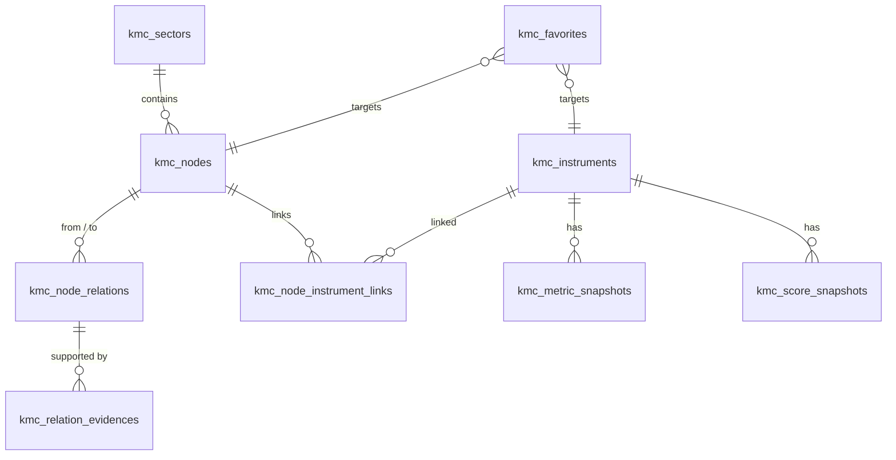

# KMC (KOOK Market Canvas) 데이터베이스 설계서 (ERD)

KMC 프로젝트의 퍼블릭 Supabase PostgreSQL 데이터베이스 스키마 설계입니다. 
접두사 `kmc_`를 사용하여 다른 기본 테이블들과의 충돌을 방지합니다.

---

## 📊 1. 전체 테이블 관계도 (Mermaid ERD)



---

## 🗄️ 2. 테이블 상세 정의

### 1. `kmc_sectors` (유망 섹터 목록)
- **설명**: AI 전력인프라, 우주항공 등 최상위 카테고리.
- **컬럼**:
  - `sector_id` (UUID, PK, Default: gen_random_uuid())
  - `slug` (VARCHAR, Unique, Indexed): URL 경로용 식별자 (예: `ai-power-grid`)
  - `name` (VARCHAR, Not Null): 섹터 한글명 (예: `AI 전력망 인프라`)
  - `description` (TEXT): 섹터 핵심 투자 테제 설명
  - `created_at` (TIMESTAMP, Default: now())

### 2. `kmc_nodes` (밸류체인 세부 노드)
- **설명**: 섹터 내부의 세부 공정, 기술, 부품 분류 (예: 초고압 변압기, CoWoS).
- **컬럼**:
  - `node_id` (UUID, PK, Default: gen_random_uuid())
  - `sector_id` (UUID, FK -> `kmc_sectors.sector_id` ON DELETE CASCADE)
  - `title` (VARCHAR, Not Null): 노드명 (예: `초고압 변압기`)
  - `node_type` (VARCHAR): `component` (부품), `material` (원소재), `service` (서비스) 등
  - `thesis` (TEXT): 해당 노드가 유망한 구체적 근거/테제
  - `risks` (TEXT): 해당 노드의 주요 리스크 및 변수
  - `updated_at` (TIMESTAMP, Default: now())

### 3. `kmc_node_relations` (노드 간 연결 관계)
- **설명**: 캔버스 상에서 산업 노드 간의 인과 및 공급선 관계.
- **컬럼**:
  - `relation_id` (UUID, PK, Default: gen_random_uuid())
  - `from_node_id` (UUID, FK -> `kmc_nodes.node_id` ON DELETE CASCADE)
  - `to_node_id` (UUID, FK -> `kmc_nodes.node_id` ON DELETE CASCADE)
  - `relation_type` (VARCHAR): `supplier` (공급), `precedent` (선행 공정), `competitor` (대체제) 등
  - `strength` (INTEGER, Default: 50): 연결 강도 (0 ~ 100, 수급/의존도 반영)
  - `evidence_count` (INTEGER, Default: 0): 연결을 보장하는 증빙자료 수

### 4. `kmc_instruments` (상장 종목 및 가상자산 마스터)
- **설명**: 주식, ETF, ETN, 암호화폐 기준 정보.
- **컬럼**:
  - `instrument_id` (UUID, PK, Default: gen_random_uuid())
  - `symbol` (VARCHAR, Unique, Not Null, Indexed): 티커 또는 종목 코드 (예: `267260`, `NVDA`)
  - `market` (VARCHAR, Not Null): `KRX` (국내), `US` (미국), `UPBIT` (암호화폐) 등
  - `name` (VARCHAR, Not Null): 자산 한글명 (예: `HD현대일렉트릭`)
  - `asset_type` (VARCHAR, Not Null): `stock` (주식), `etf` (상장지수펀드), `crypto` (가상자산)
  - `leverage_factor` (NUMERIC, Default: 1.0): 배율 (레버리지 상품인 경우 2.0 등 기록)

### 5. `kmc_node_instrument_links` (노드와 금융자산 연결 매핑)
- **설명**: 특정 산업 노드가 수혜를 입는 상장 종목들과의 다대다 매핑 테이블.
- **컬럼**:
  - `link_id` (UUID, PK, Default: gen_random_uuid())
  - `node_id` (UUID, FK -> `kmc_nodes.node_id` ON DELETE CASCADE)
  - `instrument_id` (UUID, FK -> `kmc_instruments.instrument_id` ON DELETE CASCADE)
  - `relation_role` (VARCHAR): `direct_supplier` (직접 수혜), `indirect_partner` (간접 공급), `etf_exposure` (지수 노출)

### 6. `kmc_metric_snapshots` (종목 기술/수급 데이터 스냅샷)
- **설명**: 사내 수집기에서 긁어와 갱신하는 핫 가격/수급 데이터.
- **컬럼**:
  - `snapshot_id` (UUID, PK, Default: gen_random_uuid())
  - `symbol` (VARCHAR, FK -> `kmc_instruments.symbol` ON DELETE CASCADE)
  - `price` (NUMERIC, Not Null): 현재가
  - `rsi_14` (NUMERIC): 14일 상대강도지수 (과열 판단용)
  - `foreign_5d_net` (NUMERIC): 5거래일 외인 누적 순매수액 (KRW 또는 USD)
  - `inst_5d_net` (NUMERIC): 5거래일 기관 누적 순매수액
  - `as_of` (TIMESTAMP, Not Null): 데이터 기준 시간

### 7. `kmc_score_snapshots` (투자 적합도 및 과열 점수 카드)
- **설명**: 사내 스코어링 엔진이 계산한 1차 판단 결과물.
- **컬럼**:
  - `score_id` (UUID, PK, Default: gen_random_uuid())
  - `symbol` (VARCHAR, FK -> `kmc_instruments.symbol` ON DELETE CASCADE)
  - `fit_score` (INTEGER, Not Null): 투자 적합도 점수 (0 ~ 100)
  - `overheat_score` (INTEGER, Not Null): 과열도 점수 (0 ~ 100)
  - `one_liner` (TEXT, Not Null): 룰 기반 한줄판정 요약 문구
  - `as_of` (TIMESTAMP, Not Null): 점수 산출 완료 시각

### 8. `kmc_relation_evidences` (Musk Stack 납품 증빙)
- **설명**: 노드 관계 및 Musk Stack 공급선의 공시/계약 링크 증빙.
- **컬럼**:
  - `evidence_id` (UUID, PK, Default: gen_random_uuid())
  - `relation_id` (UUID, FK -> `kmc_node_relations.relation_id` ON DELETE CASCADE)
  - `title` (VARCHAR, Not Null): 증빙 자료 제목 (예: `2026Q1 수주 계약 보고서`)
  - `url` (TEXT): DART 공시 또는 공식 보도 링크
  - `excerpt` (TEXT): 본문 핵심 요약 및 발췌문
  - `reliability` (VARCHAR): `A` (공식 계약 문서), `B` (IR/공식 언급), `C` (간접 언론사 보도)
  - `created_at` (TIMESTAMP, Default: now())

---

## ⚡ 3. Supabase DDL SQL (초기 테이블 생성용)

배포 직후 Supabase SQL Editor에 복사하여 붙여넣으면 생성되는 초기 DDL입니다.

```sql
-- Enable UUID extension
CREATE EXTENSION IF NOT EXISTS "uuid-ossp";

-- 1. Sectors
CREATE TABLE kmc_sectors (
    sector_id UUID PRIMARY KEY DEFAULT uuid_generate_v4(),
    slug VARCHAR(100) UNIQUE NOT NULL,
    name VARCHAR(150) NOT NULL,
    description TEXT,
    created_at TIMESTAMP WITH TIME ZONE DEFAULT CURRENT_TIMESTAMP
);

-- 2. Nodes
CREATE TABLE kmc_nodes (
    node_id UUID PRIMARY KEY DEFAULT uuid_generate_v4(),
    sector_id UUID REFERENCES kmc_sectors(sector_id) ON DELETE CASCADE,
    title VARCHAR(150) NOT NULL,
    node_type VARCHAR(50),
    thesis TEXT,
    risks TEXT,
    updated_at TIMESTAMP WITH TIME ZONE DEFAULT CURRENT_TIMESTAMP
);

-- 3. Instruments
CREATE TABLE kmc_instruments (
    instrument_id UUID PRIMARY KEY DEFAULT uuid_generate_v4(),
    symbol VARCHAR(50) UNIQUE NOT NULL,
    market VARCHAR(50) NOT NULL,
    name VARCHAR(150) NOT NULL,
    asset_type VARCHAR(50) NOT NULL,
    leverage_factor NUMERIC DEFAULT 1.0
);

-- 4. Node Relations
CREATE TABLE kmc_node_relations (
    relation_id UUID PRIMARY KEY DEFAULT uuid_generate_v4(),
    from_node_id UUID REFERENCES kmc_nodes(node_id) ON DELETE CASCADE,
    to_node_id UUID REFERENCES kmc_nodes(node_id) ON DELETE CASCADE,
    relation_type VARCHAR(50),
    strength INTEGER DEFAULT 50,
    evidence_count INTEGER DEFAULT 0
);

-- 5. Links
CREATE TABLE kmc_node_instrument_links (
    link_id UUID PRIMARY KEY DEFAULT uuid_generate_v4(),
    node_id UUID REFERENCES kmc_nodes(node_id) ON DELETE CASCADE,
    instrument_id UUID REFERENCES kmc_instruments(instrument_id) ON DELETE CASCADE,
    relation_role VARCHAR(50),
    UNIQUE(node_id, instrument_id)
);

-- 6. Metrics
CREATE TABLE kmc_metric_snapshots (
    snapshot_id UUID PRIMARY KEY DEFAULT uuid_generate_v4(),
    symbol VARCHAR(50) REFERENCES kmc_instruments(symbol) ON DELETE CASCADE,
    price NUMERIC NOT NULL,
    rsi_14 NUMERIC,
    foreign_5d_net NUMERIC,
    inst_5d_net NUMERIC,
    as_of TIMESTAMP WITH TIME ZONE NOT NULL
);

-- 7. Scores
CREATE TABLE kmc_score_snapshots (
    score_id UUID PRIMARY KEY DEFAULT uuid_generate_v4(),
    symbol VARCHAR(50) REFERENCES kmc_instruments(symbol) ON DELETE CASCADE,
    fit_score INTEGER NOT NULL,
    overheat_score INTEGER NOT NULL,
    one_liner TEXT NOT NULL,
    as_of TIMESTAMP WITH TIME ZONE NOT NULL
);

-- 8. Evidences
CREATE TABLE kmc_relation_evidences (
    evidence_id UUID PRIMARY KEY DEFAULT uuid_generate_v4(),
    relation_id UUID REFERENCES kmc_node_relations(relation_id) ON DELETE CASCADE,
    title VARCHAR(255) NOT NULL,
    url TEXT,
    excerpt TEXT,
    reliability VARCHAR(10) CHECK (reliability IN ('A', 'B', 'C', 'D')),
    created_at TIMESTAMP WITH TIME ZONE DEFAULT CURRENT_TIMESTAMP
);
```
